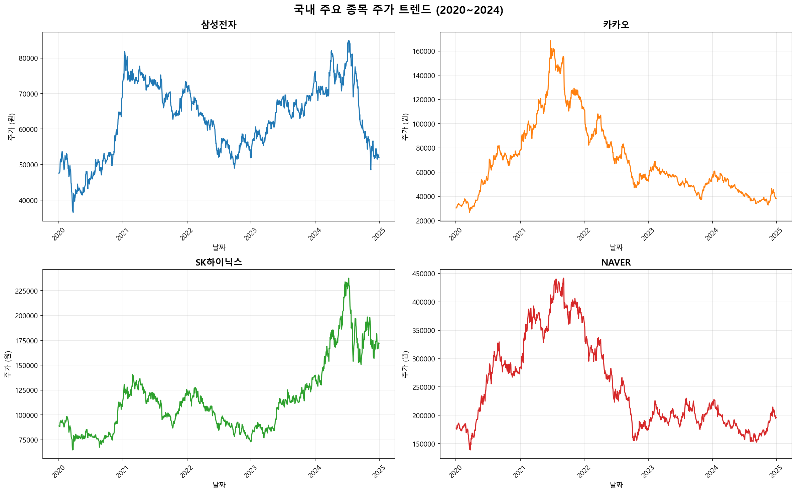
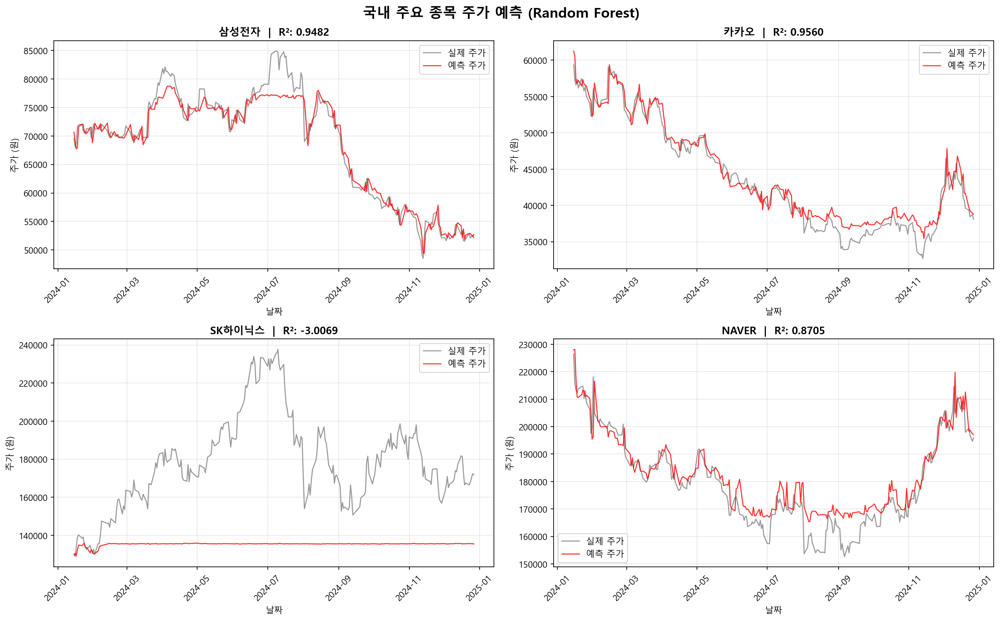

# 📈 국내 주식 데이터 분석 & 머신러닝 주가 예측

## 📌 핵심 요약
- 문제: 주가 예측이 실제로 가능한지 검증
- 결과: 단기 예측은 가능하지만 변동성 높은 종목은 예측 실패
- 결론: 머신러닝은 보조 지표로 활용하는 것이 적절

## 📌 프로젝트 개요
삼성전자, 카카오, SK하이닉스, NAVER 4개 종목의
주가 데이터를 분석하고 Random Forest로 주가를 예측한 프로젝트입니다.

## 🌐 도메인 배경
2020년 코로나 이후 국내 주식시장은 급등과 급락을 반복했습니다.
특히 2021년 동학개미운동으로 개인 투자자가 급증하였으며
AI 반도체 수요 증가로 2023년 이후 반도체 종목이 급등했습니다.
이에 따라 주요 종목의 주가 트렌드를 분석하고 머신러닝으로 예측해보고자 합니다.

## 🎯 분석 목적
- 국내 주요 종목 주가 트렌드 파악
- 종목별 주가 패턴 비교 분석
- Random Forest 모델로 다음날 주가 예측

## 🔍 가설 설정
- 가설 1. 2021년 이후 대부분 종목의 주가가 하락했을 것이다
- 가설 2. SK하이닉스는 AI 반도체 수요로 2023년 이후 급등했을 것이다
- 가설 3. 삼성전자가 가장 안정적인 주가 흐름을 보일 것이다

## 🛠️ 사용 기술
- **Language**: Python
- **Library**: Pandas, Matplotlib, Scikit-learn, yfinance
- **Database**: MySQL
- **Tool**: PyCharm, GitHub

## 📊 분석 결과

### 주가 트렌드 (2020~2024)

### 머신러닝 주가 예측

## 📊 결과 해석
- 전체적으로 종목별 주가 흐름이 다르게 나타남
- 삼성전자는 비교적 안정적인 흐름을 보임
- SK하이닉스는 외부 요인(반도체 시장)에 크게 영향 받음

## ✅ 가설 검증 결과
- 가설 1. ✅ 채택 — 카카오, NAVER 2021년 이후 급락 확인
- 가설 2. ✅ 채택 — SK하이닉스 2023년 이후 3배 급등 확인
- 가설 3. ✅ 채택 — 삼성전자 R² 0.9476으로 가장 안정적 예측

💡 핵심 인사이트
- 삼성전자, 카카오는 R² 0.94 이상으로 높은 예측 정확도 → 안정적 종목
- SK하이닉스는 외부 변수 영향으로 예측 실패 → 변동성 높은 종목
- 단기 예측은 유의미하지만 장기 예측은 제한적

## 🚀 결론 및 한계
- 머신러닝 모델은 일정 패턴을 학습하여 단기 예측에는 활용 가능
- 하지만 외부 변수(금리, 산업 변화 등)에 따라 정확도가 크게 달라짐
- 따라서 실제 투자에서는 단독 사용보다 보조 지표로 활용하는 것이 적절

## 📉 프로젝트 한계
- 시계열 특화 모델(LSTM 등) 미적용
- 외부 경제 지표 미반영
- 단일 모델(Random Forest)만 사용

👉 향후에는 다양한 모델과 지표를 결합한 분석이 필요

## 📂 파일 구조
- `main.py` - Python 분석 및 예측 코드
- `stock_trend.png` - 주가 트렌드 시각화
- `stock_prediction.png` - 머신러닝 예측 결과
